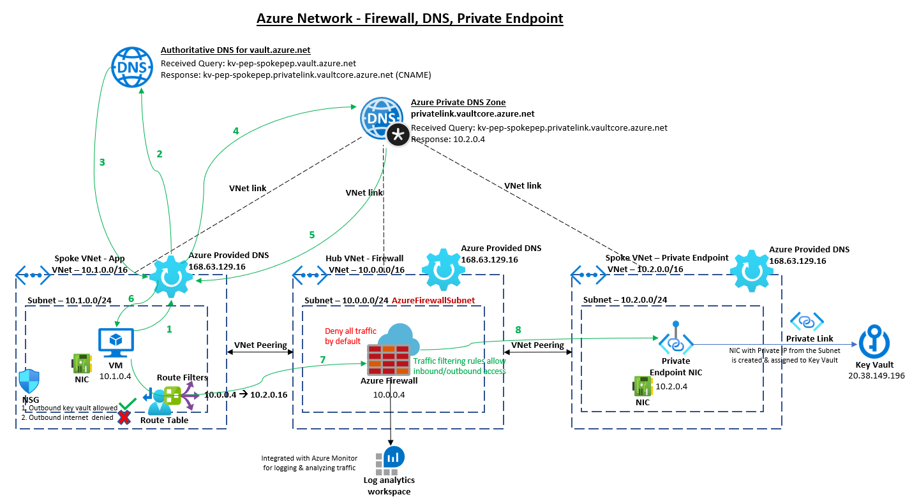

# Hub and spoke architecture - Dedicated virtual network for private endpoints

The below architecture diagram is all in the Azure & there is no integration with On-Premise.

1. VM sends a DNS query asking for IP associated to kv-pep-spokepep.vault.azure.net to Azure Provided DNS 168.63.129.16.
2. Azure Provided DNS sends query to the authoritative DNS Server that hosts kv-pep-spokepep.vault.azure.net zone and process it.
3. That authoritative DNS Server responds back to Azure provided DNS in the VNET with the correct CNAME: kv-pep-spokepep.privatelink.vaultcore.azure.net.
4. Azure Provided DNS is aware that Private DNS Zone hosts privatelink.vaultcore.azure.net zone and can process as host name (A record) from kv-pep-spokepep to its private endpoint IP 10.2.0.4.
5. Private DNS zone returns private endpoint IP back to Azure Provided DNS.
6. As final step Azure Provided DNS returns private endpoint IP back to the client.
7. The VM will now access the IP address 10.2.0.4 over peered network with Route defined at the Subnet. The next hop would be Azure Firewall service which denies all inbound/outbound traffic by default.
8. The Azure Firewall traffic filtering rules will allow the traffic to an instance of Key Vault Private Endpoint or the entire fqdn *.vault.azure.net based on the Security policies.

## Steps to create the above architecture
* [Create Hub-Spoke VNet & Peerings](vnet-readme.md)
* [Configure V-Link, DNS Zone. Create Private Endpoint in Spoke (PEP) VNet ](spoke-vnet-pep-readme.md)
* [How Private Endpoint DNS works?](https://github.com/dmauser/PrivateLink/tree/master/DNS-Integration-Scenarios)
* [Configure Spoke VNet for App](spoke-vnet-app-readme.md)
* [Configure Hub (Firewall) VNet](hub-vnet-firewall-readme.md)
* [Create Route Table](route-readme.md)
* [Validate DNS resolution & Firewall traffic filtering](validate-readme.md)
* [Configure Service Endpoint & use it to access a Key Vault](spoke-vnet-sep-readme.md)
