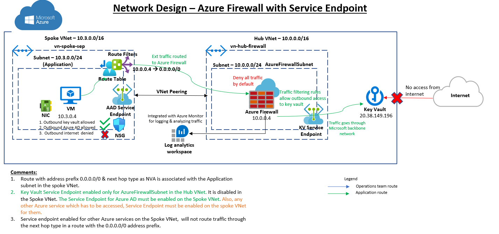

# Service Endpoint with Azure Firewall. How Azure routes traffic?
> This document is an extension of the first article "Azure Firewall with Private Endpoint & Service Endpoint" which is mentioned in the [home page](../readme.md). This article focusses on how the traffic is routed by Azure in more detail. 

## Service Endpoint routing through Azure Firewall
The following infrastructure is assumed to be present:
1. Hub VNet "vn-hub-firewall" with address space 10.0.0.0/16. The VNet contains subnet "AzureFirewallSubnet" with address space 10.0.0.0/24. The subnet contains Azure Firewall with a private IP 10.0.0.4 & also contains a Public IP address.
2. Spoke VNet "vn-spoke-sep" with address space 10.1.0.0/16. The VNet contains subnet "sn-sep" with address space of 10.1.0.0/24. The subnet contains a VM with private IP of 10.1.0.4.
3. The VNets vn-hub-firewall & vn-spoke-app are peered.
4. A VM is deployed in the Spoke VNet which will act as the application server.

To create this set up using azure cli, see the commands mentioned in the document - [Create Hub & Spoke VNets configuration](vnet-readme.md), [Create VM in a VNet](spoke-vnet-app-readme.md) & [Create Azure Firewall](hub-vnet-firewall-readme.md)

The following configurations are made for routing the traffic to Azure Key Vault from the VM hosted in the peered subnet:
1. ### Key Vault Service Endpoint on Hub AzureFirewallSubnet & User-Defined Route
    Only the Key Vault traffic is to be routed through Azure Firewall hosted in a Hub VNet via Service Endpoint. To achieve this, enable the Service Endpoint on the AzureFirewallSubnet in the Hub VNet. Azure Firewall will deny all traffic by default. So create a rule under "Application Rule Collection" to allow traffic to key vault. Also create a route that sends all traffic from the Spoke App subnet to the Azure Firewall. This route will point all traffic (0.0.0.0/0) to the Azure Firewall private IP address. This route will override the default system route 0.0.0.0/0 created by Azure. To understand the changes that occur once this user defined route is created, refer [0.0.0.0/0 address prefix in Azure](https://docs.microsoft.com/en-us/azure/virtual-network/virtual-networks-udr-overview#default-route)

    The steps to create this set up using Azure cli, the commands are mentioned in the document - [Enable Service Endpoint, configure Azure Firewall & create route](spoke-vnet-sep-readme.md)

    > Since you are no longer able to directly access resources in the subnet from the Internet after creating this route, either use Bastion to connect to the VM or allow inbound traffic to the VM via Azure Firewall. 

2. ### NSG rules on Spoke Subnet
    The NSG rules on the spoke subnet filters network traffic & contains security rules that allow or deny inbound & outbound network traffic. In this case, the following rules are applied to the outbound security rules for the VM hosted in the Spoke VNet:
    * Outbound to key vault is allowed.
    * Outbound to Azure AD is allowed.
    * Outbound to internet is denied.

    

3. ### Azure AD Service Endpoint on Spoke Subnet
    Enable Service Endpoint on the Spoke Subnet sn-sep. In this case, we don't want the Azure AD traffic to go through the Azure Firewall.

    The user-defined routing rule tells Azure that the traffic intended to internet must go through NVA. But when a Service Endpoint is enabled, traffic to the service is not routed to the next hop type in a route with the 0.0.0.0/0 address prefix, because address prefixes for the service are specified in the route that Azure creates when you enable the service endpoint, and the address prefixes for the service are longer than 0.0.0.0/0. See the effective route below:

    

    > Note that the default system route created by Azure with address prefix 0.0.0.0/0 is now invalid.

    NSG allows the traffic directed to Azure AD "*login.microsoftonline.com" & Key Vault from the spoke Subnet. Hence, Azure AD traffic is allowed on the Spoke SubNet via Service Endpoint.

To understand how azure selects a route, refer this [link](https://docs.microsoft.com/en-us/azure/virtual-network/virtual-networks-udr-overview#how-azure-selects-a-route).
