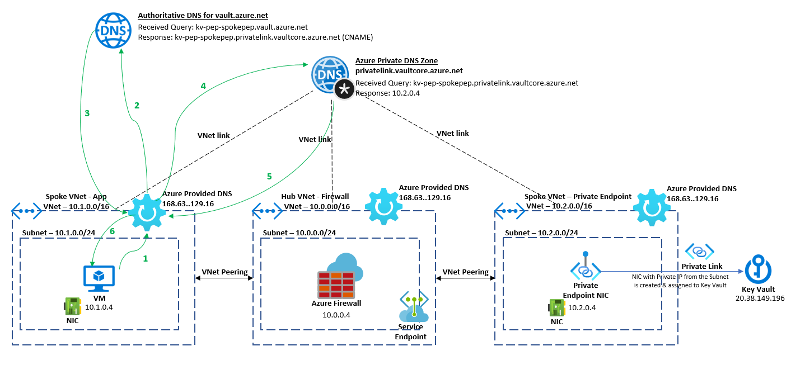
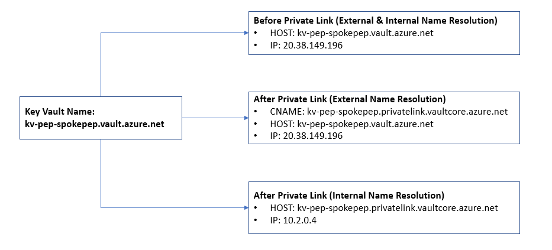
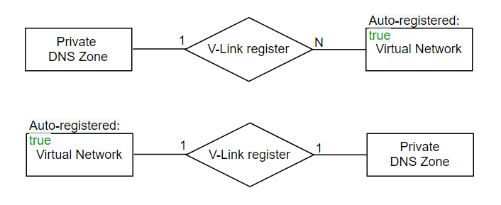
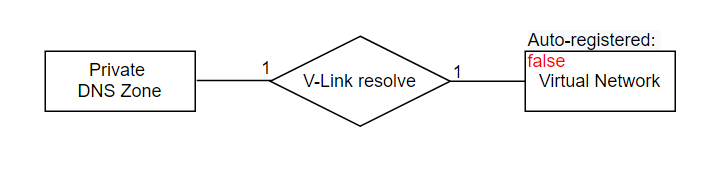
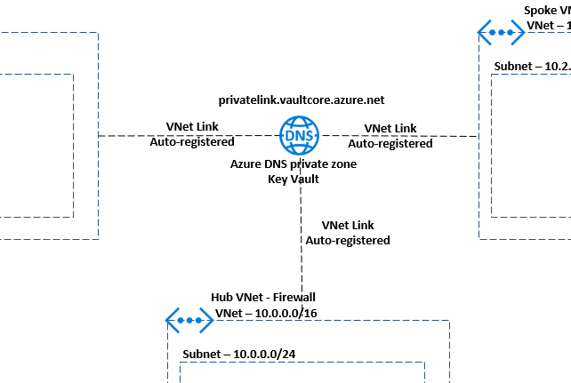
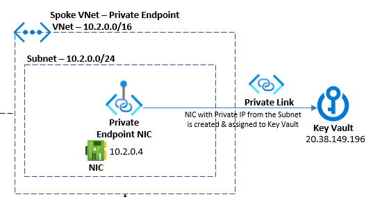

# Configure V-Link, DNS Zone. Create Private Endpoint in Spoke (PEP) VNet for Key Vault

> VNet Link & DNS zone creation & configuration is applicable for all VNets.

## Disable Virtual Network Policies
Network policies like Network Security Groups (NSG) are not supported for private endpoints. In order to deploy a Private Endpoint on a given subnet, an explicit disable setting is required on that subnet. This setting is only applicable for the Private Endpoint. For other resources in the subnet, access is controlled based on Network Security Groups (NSG) security rules definition. When using the portal to create a private endpoint, this setting is automatically disabled as part of the create process.
```bash
# Disable Virtual Network Policies for the subnet in Spoke Private Endpoint VNet
vnetName=vn-spoke-pep
subnetName=sn-pep
az network vnet subnet update --name $subnetName --vnet-name $vnetName -g $rgName --disable-private-endpoint-network-policies true
```
> Currently, you can't configure Network Security Group (NSG) rules and user-defined routes for private endpoints. NSG rules applied to the subnet hosting the private endpoint are not applied to the private endpoint. They are applied only to other endpoints (For example: network interface controllers). A limited workaround for this issue is to implement your access rules for private endpoints on the source subnets, though this approach may require a higher management overhead.

## Azure Private DNS Zone
The Domain Name System, or DNS, is responsible for translating (or resolving) a service name to an IP address. Azure DNS is a hosting service for domains and provides naming resolution using the Microsoft Azure infrastructure. Azure DNS not only supports internet-facing DNS domains, but it also supports private DNS zones.

To resolve the records of a private DNS zone from your virtual network, you must link the virtual network with the zone. Linked virtual networks have full access and can resolve all DNS records published in the private zone. You can also enable autoregistration on a virtual network link. When you enable autoregistration on a virtual network link, the DNS records for the virtual machines in that virtual network are registered in the private zone. When autoregistration gets enabled, Azure DNS will update the zone record whenever a virtual machine gets created, changes its' IP address, or gets deleted.

> *Auto registration works only for virtual machines. For all other resources like Private Endpoint NIC, internal load balancers, etc, you must create DNS records manually in the private DNS zone linked to the virtual network.*

The diagram below provides more details on the DNS resolution flow when a VM in a VNET tries to resolve private endpoint:



1. VM sends a DNS query asking for IP associated to kv-pep-spokepep.vault.azure.net to Azure Provided DNS 168.63.129.16.
2. Azure Provided DNS sends query to the authoritative DNS Server that hosts kv-pep-spokepep.vault.azure.net zone and process it.
3. That authoritative DNS Server responds back to Azure provided DNS in the VNET with the correct CNAME: kv-pep-spokepep.privatelink.vaultcore.azure.net.
4. Azure Provided DNS is aware that Private DNS Zone hosts privatelink.vaultcore.azure.net zone and can process as host name (A record) from kv-pep-spokepep to its private endpoint IP 10.2.0.4.
5. Private DNS zone returns private endpoint IP back to Azure Provided DNS.
6. As final step Azure Provided DNS returns private endpoint IP back to the client. The VM will now be able to access the KeyVault via Private Endpoint IP 10.2.0.4.

### Azure Private Endpoint DNS configuration
The FQDN of the services resolves automatically to a public IP address. To resolve to the private IP address of the private endpoint, change your DNS configuration to use the recommended zone names as described by Microsoft. Refer this [link](https://docs.microsoft.com/en-us/azure/private-link/private-endpoint-dns#azure-services-dns-zone-configuration)

For example, the Azure Key Vault private link resource type must have the private DNS zone name as "privatelink.vaultcore.azure.net". 

This means if you run the ns lookup \<key-vault-name>.vault.azure.net to resolve the IP address of your key vault over a public endpoint, you will see a result that looks like this:

```cmd
nslookup kv-pep-spokepep.vault.azure.net
Server:  UnKnown
Address:  168.63.129.16

Non-authoritative answer:
Name:    azkms-prod-cca-2-a.cloudapp.net
Address:  20.38.149.196
Aliases:  kv-pep-spokepep.vault.azure.net
          kv-pep-spokepep.privatelink.vaultcore.azure.net
          data-prod-cca.vaultcore.azure.net
          data-prod-cca-region.vaultcore.azure.net
          azkms-prod-cca-a.trafficmanager.net
```
If you run the ns lookup \<key-vault-name>.vault.azure.net to resolve the IP address of your key vault over a private endpoint
```cmd
nslookup kv-pep-spokepep.vault.azure.net
Server:  UnKnown
Address:  168.63.129.16

Non-authoritative answer:
Name:     kv-pep-spokepep.privatelink.vaultcore.azure.net
Address:  10.2.0.4
Aliases:  kv-pep-spokepep.vault.azure.net
```
Below is the summary of DNS name resolution behavior before and after enabling Private Endpoints as well as behaviors for resolution when queries are executed either on internal customer's network or external like Internet.



**Create a Private DNS Zone for Azure Key Vault Service**
```bash
# Create a Private DNS Zone for Azure Service
pdzName=privatelink.vaultcore.azure.net
az network private-dns zone create -g $rgName --name $pdzName
# For a VM, it can be any DNS name
pdzName=www.abhi-pdz.com
az network private-dns zone create -g $rgName --name $pdzName
```
## VNet Link (V-Link)
Virtual Network Link (V-Link) links a VNet to private DNS zone in Azure. Once linked, VMs hosted in that virtual network can access the private DNS zone. Every private DNS zone has a collection of virtual network link child resources. Each one of these resources represents a connection to a virtual network. A virtual network can be linked to private DNS zone as a registration or as a resolution virtual network.

### Registration virtual network
When creating a link between a private DNS zone and a virtual network, you have the option to enable autoregistration. With this setting enabled, a DNS record gets automatically created for any virtual machines you deploy in the virtual network. DNS records will also be created for virtual machines already deployed in the virtual network.

From the virtual network perspective, private DNS zone becomes the registration zone for that virtual network. A private DNS zone can have multiple registration virtual networks. However, every virtual network can only have one registration zone associated with it.



### Resolution virtual network
If you choose to link your virtual network with the private DNS zone without autoregistion, the virtual network is treated as a resolution virtual network only. DNS records for virtual machines deployed in this virtual network won't be created automatically in the private zone. However, virtual machines deployed in the virtual network can successfully query for DNS records in the private zone. These records include manually created and auto registered records from other virtual networks linked to the private DNS zone.

One private DNS zone can have multiple resolution virtual networks and a virtual network can have multiple resolution zones associated to it.



```bash
# Link the Private DNS Zone to the Virtual Networks
# Link with Spoke (Pep) VNet
vnetName=vn-spoke-pep
pdzName=privatelink.vaultcore.azure.net
vlinkName=vl-kvPep
az network private-dns link vnet create -g $rgName --virtual-network $vnetName --zone-name $pdzName --name $vlinkName --registration-enabled true
# Link with Spoke (App) VNet 
vnetName=vn-spoke-app
vlinkName=vl-kvApp
pdzName=privatelink.vaultcore.azure.net
az network private-dns link vnet create -g $rgName --virtual-network $vnetName --zone-name $pdzName --name $vlinkName --registration-enabled true
# Link with Hub (Firewall) VNet
vnetName=vn-hub-firewall
vlinkName=vl-kvFirewall
pdzName=privatelink.vaultcore.azure.net
az network private-dns link vnet create -g $rgName --virtual-network $vnetName --zone-name $pdzName --name $vlinkName --registration-enabled true
```


## Create a Key Vault
```bash
# Create a Key Vault
kvName=kv-pep-spokepep
az keyvault create -n $kvName -g $rgName -l $location --no-wait --verbose
# Turn on Key Vault Firewall
az keyvault update -n $kvName -g $rgName --default-action deny --verbose
```
## Create a Private Endpoint (Automatically Approve)
```bash
# Get the resource id for Key Vault
id=$(az keyvault show -n $kvName | jq -r ".id")
vnetName=vn-spoke-pep
subnetName=sn-pep
pepName=pep-kv
vlinkName=vl-kvPep
# Create private end point
az network private-endpoint create --name $pepName -g $rgName --vnet-name $vnetName --subnet $subnetName --private-connection-resource-id $id --group-id vault --connection-name $vlinkName -l $location
```
The above command will create Private Endpoint which is a network interface that connects you privately and securely to a service powered by Azure Private Link. When a private endpoint is created, a read-only NIC with private IP in the subnet "sn-pep" is created & assigned to the Key Vault. This cannot be modified and will remain for the life cycle of the Private endpoint.



## Create an A-record in DNS Zone for the private endpoint
```bash
# Name will be the Key Vault name for which the Private Endpoint is created
recordSetName=kv-pep-spokepep
ip4Address=$(az network private-endpoint show -n pep-kv -g $rgName | jq -r '.customDnsConfigs[].ipAddresses[]')
# Zone name will be the DNS zone name
pdzName=privatelink.vaultcore.azure.net
az network private-dns record-set a add-record --record-set-name $recordSetName -g $rgName --ipv4-address $ip4Address --zone-name $pdzName
```