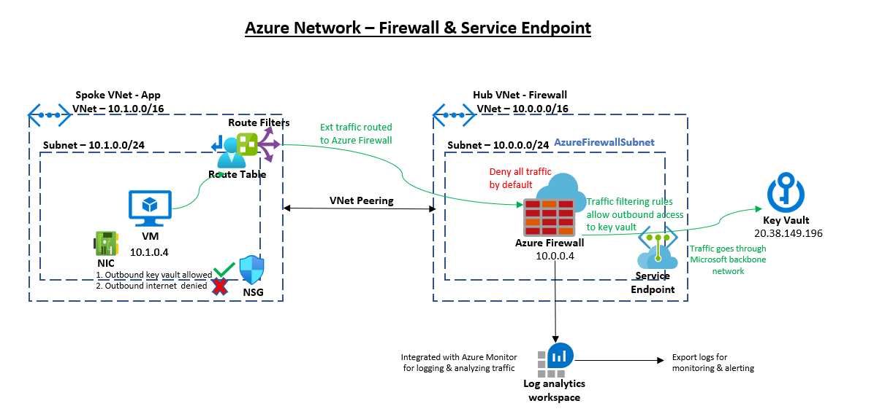
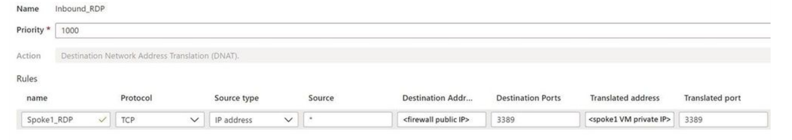
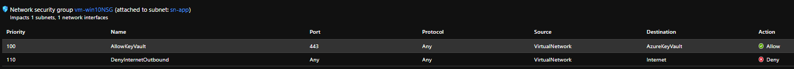

# Configure Service Endpoint in Hub (Firewall) VNet & use it to access a Key Vault

## Enable Service Endpoint on Azure Firewall Hub's subnet
```bash
# Get the list of Service Endpoint available in a location
az network service-endpoint list -l $location -o table
# Get the name of type KeyVault from the service endpoint list. Note that "contains" is case-sensitive
sepKeyVaultName=$(az network service-endpoint list -l $location | jq -r '.[] | select(.name | contains("Key")) | .name')
# Hub Firewall VNet
vnetName=vn-hub-firewall
subnetName=AzureFirewallSubnet
# Enable service endpoint for the Subnet on Hub (Firewall) VNet 
az network vnet subnet update -n $subnetName --vnet-name $vnetName --service-endpoints $sepKeyVaultName -g $rgName
```
## Create route
Create a route that sends all traffic from the Spoke App subnet to the Azure Firewall. This route will point all traffic (0.0.0.0/0) to the Azure Firewall private IP address.
```bash
routeName=AllowOutbound
# The destination CIDR to which the route applies. In this case, it is internet since the KeyVault is public endpoint.
destAddressCIDR=0.0.0.0/0
# IP address of the Virtual Appliance
nextHopIPAddress=$fwPrivateIP
# Create route
az network route-table route create -g $rgName --route-table-name $rtName -n $routeName --address-prefix $destAddressCIDR --next-hop-type VirtualAppliance --next-hop-ip-address $nextHopIPAddress
# The Spoke App subnet is already associated with the Route table, so this step is not needed here again.
```
## Create Firewall rules
The above rule will disconnect the VM. So create a NAT rule in Azure Firewall to allow RDP to the VM via Firewall. 

Azure Portal -> search for and click Firewalls -> click the newly-created firewall -> under Settings click Rules -> click NAT rule collection -> click Add NAT rule collection -> configure the rule using the settings below -> click Add to save the rule.



Next create an Application Rule in Firewall to allow traffic to Key Vault configured using Service Endpoint.
```bash
collectionName=kv-serviceEndpoint
ruleName=AllowServiceEndpoint
targetFQDN=kv-sep.vault.azure.net
fwName=fw-sep
rgName=rg-firewall
spokeAppVNet=10.1.0.0/16
az network firewall application-rule create --firewall-name $fwName --resource-group $rgName --collection-name $collectionName -n $ruleName --source-addresses $spokeAppVNet --protocols 'https=443' --target-fqdns $targetFQDN --action allow --priority 200
```

## Create a Service Endpoint enabled KeyVault & validate connection
```bash
# Create a Key Vault
kvName=kv-sep
az keyvault create -n $kvName -g $rgName -l $location --no-wait --verbose
# Turn on Key Vault Firewall
az keyvault update -n $kvName -g $rgName --default-action deny --verbose
# Add keyvault network rule to the network ACLs. In this case, it is the Azure Firewall VNet & AzureFirewallSubnet
vnetName=vn-hub-firewall
subnetName=AzureFirewallSubnet
az keyvault network-rule add --name $kvName --subnet $subnetName --vnet-name $vnetName -g $rgName
# Add a secret "abhi" in the key vault
```
Update the NSG rules on the Spoke (App/VM) subnet as shown below. This will ensure that the outbound traffic internet is blocked for the VM but allowed to Key Vault.



## Validate the network connectivity
```cmd
C:\Users\abhinab>nslookup kv-sep.vault.azure.net
Server:  UnKnown
Address:  168.63.129.16

Non-authoritative answer:
Name:    azkms-prod-cca-3-a.cloudapp.net
Address:  52.246.157.4
Aliases:  kv-sep.vault.azure.net
          data-prod-cca.vaultcore.azure.net
          data-prod-cca-region.vaultcore.azure.net
          azkms-prod-cca-a.trafficmanager.net
```
Run the below command & it should return 200 ok
```bash
# Get the OAuth2.0 token
tenantID=$(az account list | jq -r '.[0].tenantId')
client_id=zzzzzz
client_secret=xxxxx
# Get the token in json response 
json=(curl --location --request POST 'https://login.microsoftonline.com/$tenantID/oauth2/v2.0/token' \
--header 'Content-Type: application/x-www-form-urlencoded' \
--data-urlencode 'grant_type=client_credentials' \
--data-urlencode 'client_id=$client_id' \
--data-urlencode 'client_secret=$client_secret' \
--data-urlencode 'scope=https://vault.azure.net/.default')
# Get the token string
jwt=$( jq -r ".access_token" <<<"$json" )
# Get the secret
curl --location --request GET "https://kv-sep.vault.azure.net/secrets/abhi/3c92447c81e34af8a37608ce47ebf168?api-version=2016-10-01" --header 'Authorization: Bearer '$jwt''
```