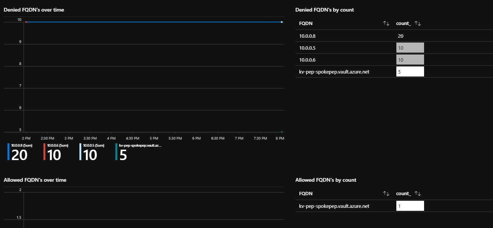

# Validate DNS resolution & Firewall traffic filtering
At this stage, we have the Hub & Spoke Architecture with three VNets, corresponding subnets & resources as shown in the table below.

|  VNet |   Subnet  |   Resource    |   IP  |
|   :-  |   :-  |   :-  |   :-  |
|Hub Firewall - 10.0.0.0/16   |AzureFirewallSubnet - 10.0.0.0/24    |Firewall    |10.0.0.4  |
|Spoke App/VM - 10.1.0.0/16 |sn-app - 10.1.0.0/24   |VM |10.1.0.4   |
|Spoke Pep - 10.2.0.0/16    |sn-pep - 10.2.0.0/24   |Pep Key Vault  |10.2.0.4   |

The spoke VNets are peered with the Hub VNet but there is no direct connectivity between the two spoke VNets. The Private DNS Zone for KeyVault is linked to all the three VNets.

At this stage, login to the VM & run nslookup to kv-pep-spokepep.vault.azure.net. It should resolve the FQDN to its Private IP.
```cmd
C:\Users\abhinab>nslookup kv-pep-spokepep.vault.azure.net
Server:  UnKnown
Address:  168.63.129.16

Non-authoritative answer:
Name:    kv-pep-spokepep.privatelink.vaultcore.azure.net
Address:  10.2.0.4
Aliases:  kv-pep-spokepep.vault.azure.net
```

## What's the role of Azure Firewall?
All the traffic from the App/VM spoke VNet going to Private Endpoint Spoke VNet will be routed & filtered by the Azure Firewall. By default, all traffic is denied. 

We can see this in the Firewall logs via Azure Monitor or log analytics workspace workbook. Since we have already set up Firewall logs using Diagnostics Settings, import the dashboard [file](https://raw.githubusercontent.com/Azure/azure-docs-json-samples/master/azure-firewall/AzureFirewall.omsview) as described [here](https://docs.microsoft.com/en-us/azure/firewall/firewall-diagnostics#view-and-analyze-the-network-and-application-rule-logs).

From the VM, send requests to the Key Vault. Create a secret "abhi" in the Key Vault & fetch its value from the VM.
```bash
# Get the OAuth2.0 token
tenantID=$(az account list | jq -r '.[0].tenantId')
client_id=zzzzzz
client_secret=xxxxx
# Get the token in json response 
json=(curl --location --request POST 'https://login.microsoftonline.com/$tenantID/oauth2/v2.0/token' \
--header 'Content-Type: application/x-www-form-urlencoded' \
--data-urlencode 'grant_type=client_credentials' \
--data-urlencode 'client_id=$client_id' \
--data-urlencode 'client_secret=$client_secret' \
--data-urlencode 'scope=https://vault.azure.net/.default')
# Get the token string
jwt=$( jq -r ".access_token" <<<"$json" )
# Invoke the key vault secret
curl --location --request GET "https://kv-pep-spokepep.vault.azure.net/secrets/abhi/3c92447c81e34af8a37608ce47ebf168?api-version=2016-10-01" --header "Authorization: Bearer '$jwt'" -I

curl: (35) schannel: failed to receive handshake, SSL/TLS connection failed
```
Ideally it should have returned 200 OK but the Firewall is denying all the request since there is no rule defined yet.


Lets add a Firewall rule to allow traffic to this Key Vault.

## Configure Application Rule in Azure Firewall
Configure an application rule to allow communication between the VM & private endpoint for Key Vault.
```bash
collectionName=kv-privateEndpoint
ruleName=kv-privateEndpoint
targetFQDN=kv-pep-spokepep.vault.azure.net
fwName=fw-sep
rgName=rg-firewall
spokeAppVNet=10.1.0.0/16
az network firewall application-rule create --firewall-name $fwName --resource-group $rgName --collection-name $collectionName -n $ruleName --source-addresses $spokeAppVNet --protocols 'https=443' --target-fqdns $targetFQDN --action allow --priority 100
```
Run the curl command now & it will return 200 ok.
```bash
curl --location --request GET "https://kv-pep-spokepep.vault.azure.net/secrets/abhi/3c92447c81e34af8a37608ce47ebf168?api-version=2016-10-01" --header 'Authorization: Bearer '$jwt''
```



## Enabling the firewall rule for all Key Vault private endpoint zones
Update the target FQDN in the rule to "*.vault.azure.net". This will enable the traffic to all the private endpoint Key Vaults.