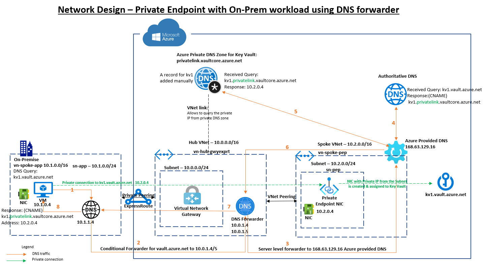

# Private Endpoint & integration with On-Prem DNS

### DNS route
1. VM sends a DNS query asking for IP associated to kv1.vault.azure.net to the internal on-premise DNS 10.1.1.4.
2. A conditional forwarder configured in the DNS server will forward the request to the custom DNS forwarder's IP address 10.0.1.4 or 10.0.1.5 (Two instance of custom DNS servers for HA).
3. The DNS forwarder will forward the request to Azure provide DNS server i.e. 168.63.129.16.
4. Azure Provided DNS sends query to the authoritative DNS Server that hosts vault.azure.net zone and process it. That authoritative DNS Server responds back to Azure provided DNS in the VNET with the correct CNAME: kv1.privatelink.vaultcore.azure.net.
5. Azure Provided DNS is aware that Private DNS Zone hosts privatelink.vaultcore.azure.net zone and can process the host name (A record) from kv1 to its private endpoint IP 10.2.0.4. Private DNS zone for key vault returns private endpoint IP back to Azure Provided DNS.
6. Azure Provided DNS returns private endpoint IP back to the client i.e. DNS forwarder.
7. DNS forwarder returns private endpoint IP back to the internal DNS.
8. Internal DNS sends the CNAME kv1.privatelink.vaultcore.azure.net & the private IP address 10.2.0.4 to the VM. The VM will now be able to access the Key Vault via Private Endpoint IP 10.2.0.4.

### Private connection route
The VM makes a call to the Key Vault's private IP address via Express Route private peering through the hub VNet hosting the Virtual Network Gateway of type Express Route to the peered subnet dedicated for the private endpoint. The private IP associated with the NIC is assigned to the Key Vault & the traffic is routed through the Microsoft network via Private Link.