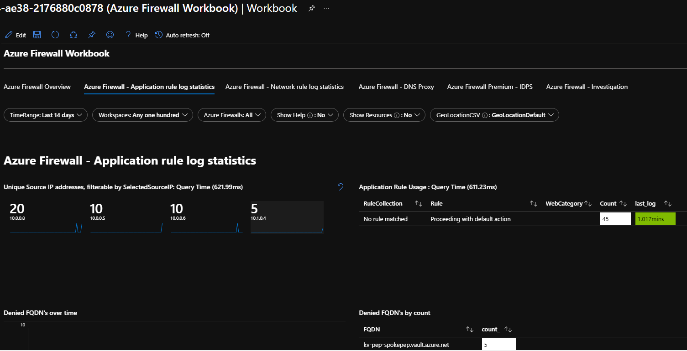
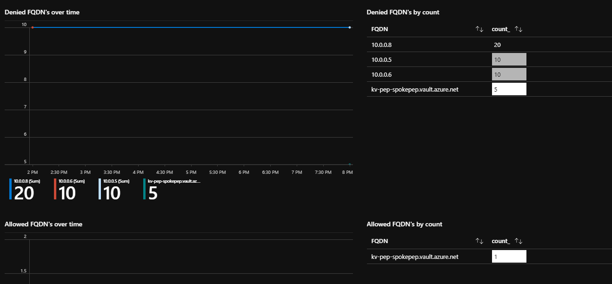

# Validate DNS resolution & Firewall traffic filtering
At this stage, we have the Hub & Spoke Architecture with three VNets, corresponding subnets & resources as shown in the table below.

|  VNet |   Subnet  |   Resource    |   IP  |
|   :-  |   :-  |   :-  |   :-  |
|Hub Firewall - 10.0.0.0/16   |AzureFirewallSubnet - 10.0.0.0/24    |Firewall    |10.0.0.4  |
|Spoke App/VM - 10.1.0.0/16 |sn-app - 10.1.0.0/24   |VM |10.1.0.4   |
|Spoke Pep - 10.2.0.0/16    |sn-pep - 10.2.0.0/24   |Pep Key Vault  |10.2.0.4   |

The spoke VNets are peered with the Hub VNet but there is no direct connectivity between the two spoke VNets. The Private DNS Zone for KeyVault is linked to all the three VNets.

At this stage, login to the VM & run nslookup to kv-pep-spokepep.vault.azure.net. It should resolve the FQDN to its Private IP.
```cmd
C:\Users\abhinab>nslookup kv-pep-spokepep.vault.azure.net
Server:  UnKnown
Address:  168.63.129.16

Non-authoritative answer:
Name:    kv-pep-spokepep.privatelink.vaultcore.azure.net
Address:  10.2.0.4
Aliases:  kv-pep-spokepep.vault.azure.net
```

## What's the role of Azure Firewall?
All the traffic from the App/VM spoke VNet going to Private Endpoint Spoke VNet will be routed & filtered by the Azure Firewall. By default, all traffic is denied. 

We can see this in the Firewall logs via Azure Monitor or log analytics workspace workbook. Since we have already set up Firewall logs using Diagnostics Settings, import the dashboard [file](https://raw.githubusercontent.com/Azure/azure-docs-json-samples/master/azure-firewall/AzureFirewall.omsview) as described [here](https://docs.microsoft.com/en-us/azure/firewall/firewall-diagnostics#view-and-analyze-the-network-and-application-rule-logs).

From the VM, send requests to the Key Vault.
```cmd
C:\Users\abhinab>curl https://kv-pep-spokepep.vault.azure.net -I -k
curl: (35) schannel: failed to receive handshake, SSL/TLS connection failed
```
Ideally either it should have returned 200 OK or 403 Forbidden but the Firewall is denying all the request since there is no rule defined yet.



Lets add a Firewall rule to allow traffic to this Key Vault.

## Configure Application Rule in Azure Firewall
Configure an application rule to allow communication between the VM & private endpoint for Key Vault.
```bash
collectionName=kv-privateEndpoint
ruleName=kv-privateEndpoint
targetFQDN=kv-pep-spokepep.vault.azure.net
fwName=fw-sep
rgName=rg-firewall
spokeAppVNet=10.1.0.0/16
az network firewall application-rule create --firewall-name $fwName --resource-group $rgName --collection-name $collectionName -n $ruleName --source-addresses $spokeAppVNet --protocols 'https=443' --target-fqdns $targetFQDN --action allow --priority 100
```
Run the curl command now & it will return 403 or 200 ok.
```cmd
C:\Users\abhinab>curl https://kv-pep-spokepep.vault.azure.net -I -k
HTTP/1.1 403 Forbidden
Content-Length: 1233
Content-Type: text/html
X-Powered-By: ASP.NET
Strict-Transport-Security: max-age=31536000;includeSubDomains
X-Content-Type-Options: nosniff
Date: Mon, 10 May 2021 05:46:52 GMT
```



## Enabling the firewall rule for all Key Vault private endpoint zones
Update the target FQDN in the rule to "*.vault.azure.net". This will enable the traffic to all the private endpoint Key Vaults.

## Create a Service Endpoint enabled KeyVault & validate connection
```bash
# Create a Key Vault
kvName=kv-sep-fw
az keyvault create -n $kvName -g $rgName -l $location --no-wait --verbose
# Turn on Key Vault Firewall
az keyvault update -n $kvName -g $rgName --default-action deny --verbose
# Add keyvault network rule to the network ACLs. In this case, it is the Azure Firewall VNet & AzureFirewallSubnet
vnetName=vn-hub-firewall
subnetName=AzureFirewallSubnet
az keyvault network-rule add --name $kvName --subnet $subnetName --vnet-name $vnetName -g $rgName
```
Update the NSG rules on the Spoke (App/VM) subnet as shown below. This will ensure that the outbound traffic internet is blocked for the VM but allowed to Key Vault.


Validate the network connectivity by running the below commands.
```cmd
C:\Users\abhinab>nslookup kv-sep-fw.vault.azure.net
Server:  UnKnown
Address:  168.63.129.16

Non-authoritative answer:
Name:    azkms-prod-cca-3-a.cloudapp.net
Address:  52.246.157.4
Aliases:  kv-sep-fw.vault.azure.net
          data-prod-cca.vaultcore.azure.net
          data-prod-cca-region.vaultcore.azure.net
          azkms-prod-cca-a.trafficmanager.net


C:\Users\abhinab>curl https://kv-sep-fw.vault.azure.net -I
HTTP/1.1 403 Forbidden
Content-Length: 1233
Content-Type: text/html
X-Powered-By: ASP.NET
Strict-Transport-Security: max-age=31536000;includeSubDomains
X-Content-Type-Options: nosniff
Date: Mon, 10 May 2021 20:47:29 GMT
```